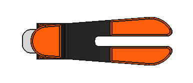
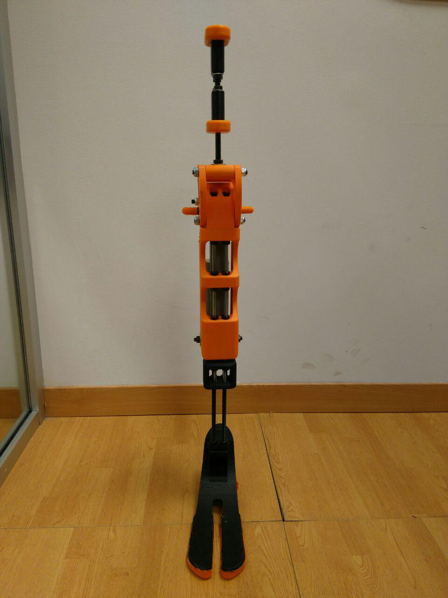
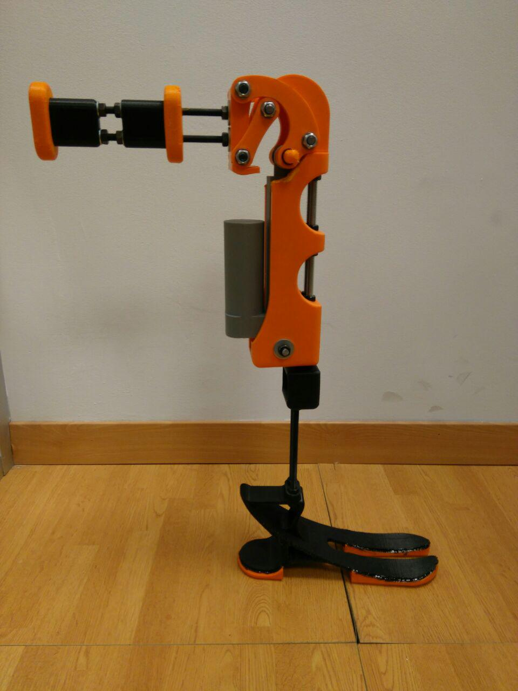
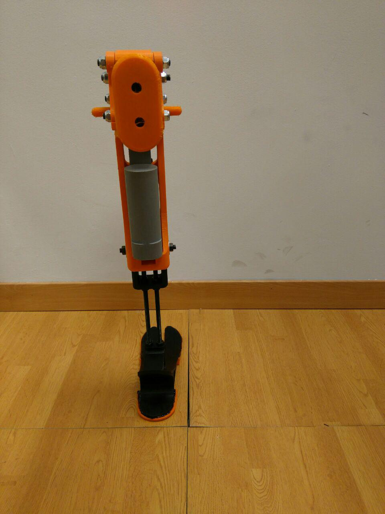
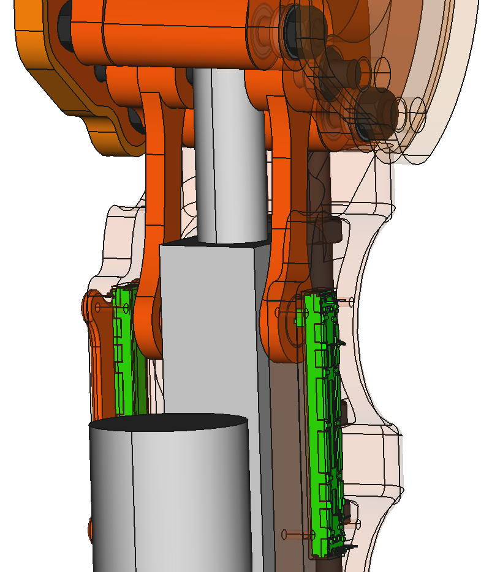
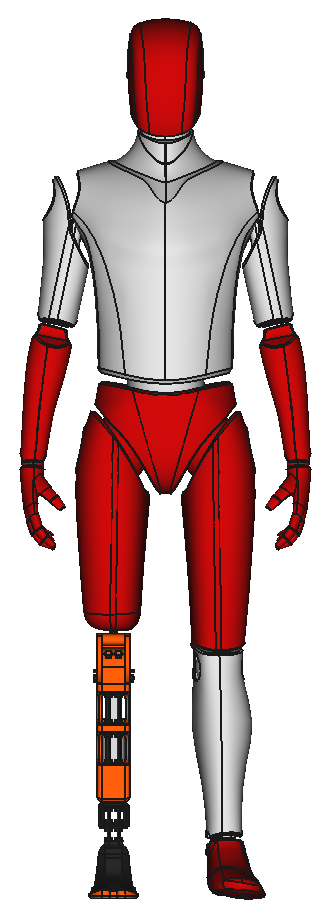

 

 
<h3 align="center">A printable robotic leg with the size of a human leg.</h3>
 

# Leg model

## First Freecad design

   

 

## First prototype

   

  

## Second Freecad design with the electronics and a foot inspired by the goat's hooves

   

 

## Second prototype with the electronics and a foot inspired by the goat's hooves

# Human model

**Original design of the human model: [Jarde Dummy](https://grabcad.com/library/jarde-dummy-1) by [Jari Ikonen](https://grabcad.com/jari.ikonen-2).**

   

# License

Drakkar is licensed under a [Creative Commons Attribution-ShareAlike 4.0 International License](http://creativecommons.org/licenses/by-sa/4.0/).

