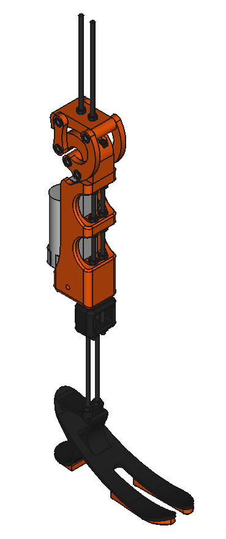
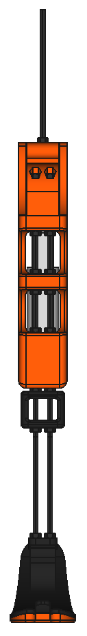
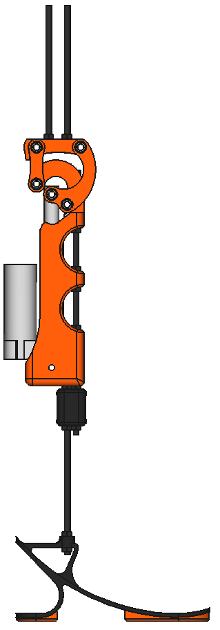
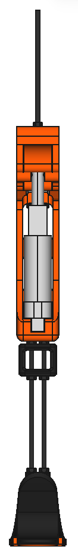
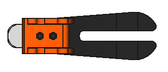
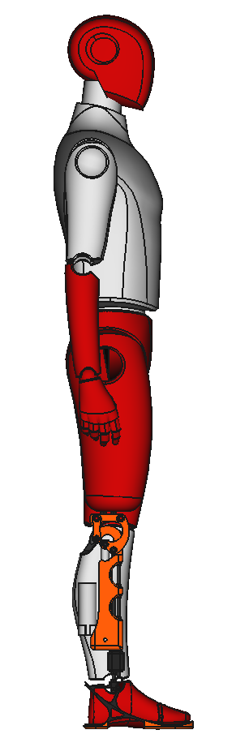

 

 

# Drakkar

A printable robotic leg with the size of a human leg.

## Leg model

   

## Human model

**Original design of the human model: [Jarde Dummy](https://grabcad.com/library/jarde-dummy-1) by [Jari Ikonen](https://grabcad.com/jari.ikonen-2).**

   

## License

Drakkar is licensed under a [Creative Commons Attribution-ShareAlike 4.0 International License](http://creativecommons.org/licenses/by-sa/4.0/).

