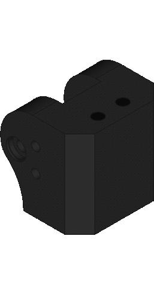

# N7 Anvil assembly (*in progress*)

## Knee step by step

### Insert 2 M3 nuts in the knee.

### Insert the endstop in the knee and use 2 M3 screws to fix it.

### Insert 2 mf1482rs bearings in the knee.

### Places the knee bar and its 4 mf1482rs bearing.

### Use a M8 threaded rod as axis and M8 autoblock nuts to not tighten the bearings.

## Leg step by step

### Insert 2 M8 nuts in foot part.

### Insert 2 threaded rods.

### Insert the motor holder in the threaded rods and put the linear actuator.

### Place the motor cover in the threaded rods, the motor's bars and the potentiometer's linker. Use a threaded rods to fix the motor's bar and cut it at the edge of the plastic bars.

### Insert the potentiometer holder in the threaded rods and intert 4 M3 nuts in it.

### Insert the potentiometer in its holder. Take care with the potentiometer's bar, put it in the same position as the potentiometer linker.

### Insert the top part and fix it with the potentiometer linker with a M3 screw and a nut.

### Places the knee and use 2 M8 nuts to fix all parts.

### Places the potentiometer cover and use 4 M3 screws to fix it.

### Places the back part and fix it with 4 M3 screws and nuts.

